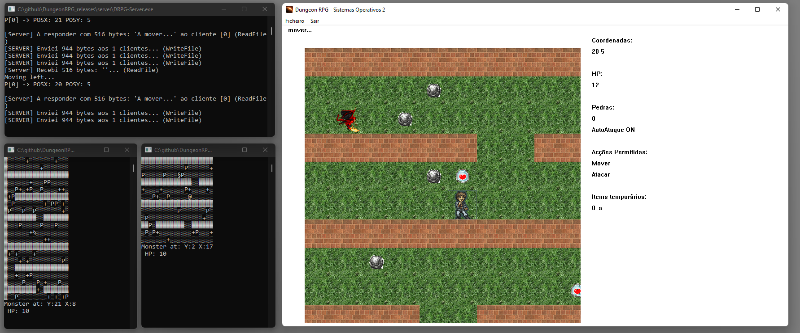

# DungeonRPG

This project has been done by [André Oliveira](https://github.com/AndreOliveiraRepos) and I during our Computer Science degree for the Operating Systems Course, where we have scored full marks.

DungeonRPG is a multiplayer game where players must collect items randomly placed on a map while dealing with monsters and other players. The game uses Windows API to create a graphical user interface and has been written using Visual Studio 2015 v140 PlatformToolset.

___

## Build

You can build this project on the command line by using tools that are included in Visual Studio. The Microsoft C++ (MSVC) compiler toolset is also downloadable as a standalone package. You don't need to install the Visual Studio IDE if you don't plan to use it.

This article describes how to compile a C program on the command line on Windows:
https://learn.microsoft.com/en-us/cpp/build/walkthrough-compile-a-c-program-on-the-command-line?view=msvc-170

Copy DRPGClientDLL.lib to:
 - SO2-DungeonRPG\DungeonRPG\DRPG-Client
 - SO2-DungeonRPG\DungeonRPG\Debug

___

## Description

This repository contains three Visual Studio Solutions:
- Server
- Client GUI
- Client DLL

Multiple clients can connect to the running server through named pipes. When there are enough players waiting, one of the waiting players can __Start__ the game.
The server also contains **Monster** processes that will be walking around the map. One process per monster. Monsters access the existing map through Shared Memory (where players will be moving as well).

The following Figure "DungeonRPG Gameplay" presents an overview of the game.

With regard to Figure "DungeonRPG Gameplay", 
- The top left window presents the Server Instance displaying exchanged messages and internal status.
- The bottom left windows are the monster processes (two windows, so two monsters walking on the map). Monsters will spawn more Monsters (processes) upon killing players.
- On the right side of the screen is the Game window where the Game map is displayed as well as players' status. For instance, it can be seen that a monster is nearbly, items on the floor that can be collected and brick-walls that cannot be traversed. On the right panel, it can be visualised the Player coordinates, HP, Stones (incresing the attack against monsters and other players), Auto-attack toggled on/off as a player might want to save its stones for later in the game, allowed actions, and temporary items e.g., caffeine sweets that provide temporary movement speed.

## Development and Branching

This project is something that we passionately did 7 years ago, previous last commits in Jun 12, 2016. We will keep the original code intact in the "original_vs2015-v140" branch if you want to see the original code.

So, what is planned?
- Back then, we have written a lot of code in Portuguese, we plan to refactor everything to the English Language
- Write a CMake
- Correct existing bugs

Latest developments will be placed on the **dev** branch.

## Known bugs

- The client does not dispose all the resources when closed.
- No sprite is displayed when when a monster is on the same tile with an item.
- Deadlocks might happen during players enconter.

